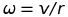

# **Behavioral Cloning** 
---
The goal of this project was to collect data by driving a car in a simulator and
train a CNN model with the collected data to replicate the recorded driving
behaviour.

## Writeup
The purpose of this writeup is to give more insight in to the CNN architecture
developed using keras in the foreground for project 3 of self-driving car
nanodegree program offered by Udacity.

The goals / steps of this project are the following:
* Use the simulator to collect data of good driving behavior.
* Build, a convolution neural network in Keras that predicts steering angles
from images.
* Train and validate the model with a training and validation set.
* Test that the model successfully drives around track one without leaving the
road.
* Summarize the results with a written report.

[//]: # (Image References)

[image1]: ./images/architecture.png "Architecture"
[image2]: ./images/center.png "Center"
[image3]: ./images/center_flipped.png "Center flipped"
[image4]: ./images/left.png "Left"
[image5]: ./images/left_flipped.png "Left flipped"
[image6]: ./images/right.png "Right"
[image7]: ./images/right_flipped.png "Right flipped"
[image8]: ./images/epochs.png "Loss graph"

---

## 1. Purpose
This reflection document describes the procedure adopted in designing and
training a new model to clone the behaviour of a car driven on a simulator.

The contents of this document are listed as follows,
* Rubic points
* Procedure
* Enhancing performance
* Conclusion

---

## 2. Rubic points
This section lists all the Rubic criterias and gives an overview of how each
criterias are satisfied.

### 2.1. Required files
All required files have been submitted. The list of submitted files are as
follows,

* model.py - Contains the python script to create, train and save the model.
* drive-py - Drives the car in autonomous mode.
* model.h5 - The trained and saved convolutional network.
* video.mp4 - A video generated from an autonomous lap around the track.
* writeup.md - A writeup report which explains the procedure taken.

### 2.2. Quality of code

#### 2.2.1. Is the submitted core functional?
The submitted code is functional and is capable of training and saving a CNN as
long as the correct location to the training images are provided.

#### 2.2.2. Is the code usable and readable?
The provided core is completely functional as long as it is provided with the
correct location to a set of training images. It is also capable of saving a
model with the the name _'model.h5'_ which can be used along with
'_drive.py_' to run the simulator in autonomous mode, using the code mentioned
below.

```sh
python drive.py model.h5
```

The code is organised and contains numerous comments to explain the procedure undertaken.

The code is designed to be run on platforms with the least required memory by
using a generator to load the images batch wise. If memory limitations are
encountered, the batch size can be decreased.

### 2.3. Model architecture and training strategy

#### 2.3.1. Has an appropriate model architecture been employed for the task?
An appropriate model architecture has been implemented for the task of staying
in lane. The implemented architecture is based on a designed lane-keeping model
developed and published by Ford motor company [@DeepLanes]. They claim that the
model is very simple and is capable of running in real-time.

More details of the model architecture can be found in section 3.1.1.

#### 2.3.1. Has an attempt been made to reduce overfitting of the model?
The recorded images from the simulator were split into train and validation sets
whose MSE were calculated for each epoch. Existance of overfitting was found by
comparing the MSE of the training set against the validation set. Overfitting
was handled by introducing dropout layers between the fully connected layers. A
dropout of **50%** was used, which significantly improved the training and
validation MSEs and the robustness.

More details of overfitting and data split can be found in section 3.2.3.

#### 2.3.2. Have the model parameters been tuned appropriately?
The model parameters were tuned with an approriate set of training data with an
'_Adam_' solver. The number of epochs were tuned in such a way that both the
training and validation loss decreases, resulting in no over/underfitting.

More details of model tuning can be found in section 3.2.3.

#### 2.3.4. Is the training data chosen appropriately?
The training data was chosen as a random split of 80% from the complete recorded
dataset. The recorded dataset was gathered in iterations with one lap of
anti-clockwise driving in the first iteration. Then the model architecture was
selected based on this data. Then more data was collected to train the model in
order to drive through stronger curves and different road sections.

Images from the left and right cameras were also used for model training. The
labels of these images were corrected with a correction factor derived from the
rotational velocities. 

More information on this requirement is found in section 3.2.1.

Basic informatino of the training and validation set,

| Data set			| Number of samples|
|:------------------------------|:------------:|
| Training set		| 30407|
| Validation set	| 13033|


The gathered list of data includes,
- Two lap of anti-clockwise driving.
- One lap of clockwise driving.
- One lap of corrective anti-driving.
- Separate regions of strong curves in anti-clockwise direction.
- Flipping of all the above images along the vertical axis (need not be
collected, but the model.py does this).

### 2.4. Architecture and training documentation

#### 2.4.1. Is the solution design documented?
Section 3.2.3. satisfies this criteria.

#### 2.4.2. Is the model architecture documented?
Section 3.1. satisfies this criteria.

#### 2.4.3. Is the creation of the training dataset and training process documented?
Section 3.2.1. satisfies this criteria.

### 2.5. Simulation

#### 2.5.1. Is the car able to navigate correctly on test data?
The submitted -video.mp4_ file satisfies this criteria. This video shows that the
ego vehicle drives within the lanes of the road, but gets closer to the lanes in
some cases, but recovers from the offset and tries to go back to the center of
the lane.

##### Other inferences
A mentionable inference is the tuning of number of epochs for the least loss
in train and validation sets often resulted in the ego vehicle running off road.
The reason for this can be that the velocity of the ego vehicle was not used for
training but only the steering angle is used to train the model. Hence the model
knows to stay in lane for certain velocities which corresponds to velocities in
data collection step. Hence there is a huge risk that the predicted steering
angle with the least loss, might not keep the ego vehicle inside the lanes for
some velocities (this was not tested, but inferred with intuition).

##### Reproducibility
It was also observed that a different setting on the visualization display
performance can sometime make the car drive off the road (which is still rare).
It did make a difference when the laptop (on which the development and tests
were performed) is not powered, there is a huge lag between the model's output
and the response of the ego vehicle. That often made the ego vehicle run off
road. Hence to prove the performance, a _video.py_ has been created which shows
the test performance on the development platform itself.

Recommended steps to use the newly trained _model.h5_ in simulation,
- Please make sure that the collected data corresponds to the list mentioned in
section 2.3.4.
- Use resolution 1024x768.
- Use _Beautiful_ for graphics quality.
- Make sure the laptop is connected to the power supply (if using one).

The above mentioned steps, if followed, must result in the ego vehicle driving
well within the lanes, with as minimum yaw as possible, thus, satisfying the
criteria.

---

## 3. Procedure
This section describes the procedure undertaken in detail for cloning a
behaviour recorded on the provided simulator.

### 3.1. Model architecture
Finding the right model architecture was considered to be the most crucial step.
Initially images on a straight section of the simulator were recorded and used
for evaluating different model architectures. The architectures considered for
evaluation are listed as,

- LeNet.
- Nvidia's end-to-end CNN architecture.
- Ford's end-to-end deep lanes architecture.

The architectures were modelled using keras 2 one after the other and their
performances in train and validation loss were recorded for a fixed number of 5
epochs. Once trained, the model is saved and then used to on the simulator in
autonomous mode. It was observed that the performance of LeNet architecture
was quite bad inspite of the produced losses.

The Nvidia's and Ford's architecture seems to have similar behaviours on the
simulator. With a bit of yawing, the ego vehicle on the simulator was able to
run for a few meters, before running off road. Eventhough, it didn't make much
difference, it was decided to go ahead with Ford's architecture instead of
Nvidia's (as I assumed it would be fun to try something different from what's
stated in the course work).

#### 3.1.1. The architecture
Here the information about the architecture is given. It was learnt that the
main purpose of this architecture was to keep it simple and make processing
efficient on GPU by using as less layers as possible in order to enable things
running in real-time [[@DeepLanes]]. Noticably, the considered
architecture has fewer convolutions and fully connected layers than the Nvidia's
architecture.

The original architecture is shown in Figure below,

![Orignial Architecture][image1]
**Original Architecture**

Since the sizes of the images from the simulator is different from the ones
used by Ford's architecture, some changes are made to the convolutional layers
and max pooling layers. The final architecture developed is stated in the table
below,

Assuming S = strides, P = padding,

| Layer				| Size | output |
|:------------------------------|:------------------------:|:------------:|
| Input				| 160x320x3 3-color channel image|
| Cropping2D			| Crop sky and car hood| 90x320x3 |
| Convolution 10x10		| S:6x6, P:'VALID'| 14x52x32|
| Activation - ELU				|  |  |
| Maxpooling 2x2		| S:2x2 | 7x26x32 |
| Convolution 5x5		| S:1x1, P:'VALID'| 3x22x64|
| Activation - ELU				|  |  |
| Maxpooling 2x2		| S:2x2 | 1x11x64 |
| Flatten			|  | 704 |
| Fully connected layer 1	| 704 | 2048 |
| Activation - ELU				|  |  |
| Dropout			| 50% |  |
| Fully connected layer 2	| 2048 | 317 |
| Activation - ELU				|  |  |
| Dropout			| 50% |  |
| Fully connected layer 3	| 317 | 100 |
| Activation - ELU				|  |  |
| Dropout			| 50% |  |
| Fully connected layer 4	| 100 | 1 |
|  |  |  |
|  |  |  |

It can be seen that the architecture consists of 2 convolutional layers and 4
fully connected layers. It is worth mentioning that Exponential linear unit
(ELU) was used as activation in places of Rectified Linear Unit (ReLUs). Inspite of 
introducing non-linearity to the model, the main difference between the ReLUs
and ELUs is the output. ELUs start from a minimum value of '-1' and hence can
provide more information while activation. Moreover the ELUs are prone to train
faster than the ReLUs and hence can be effecitient memory and power consumption
wise.

Cropping of unwanted sections of the image was performed using the Cropping2D
function available in Keras. This ensured significant increase in performance
by using the GPU to crop the images instead of the CPU.

### 3.2. Training procedure
This section describes the training and tuning procedure for accomplishing
autonomous driving on the simulator.

An iterative approach was considered for the training procedure where the
number of training images were increased iteratively. The colleced images were
split into train and validation sets in a ratio of 4:1 respectively. The goal
was to achieve minimum loss in MSE for the train and validation sets without 
overfitting. Hence the trained model after each iteration was run on the
simulator to mark the difference in performance.

The core iterative steps of the training procedure are stated as follows,
- Increase the collected data.
- Split the data into train and validation sets.
- Train the model.
- Check performance of the model on the simulator.
- Repeat to improve performance.

#### 3.2.1. Adding more data
The ego vehicle while running in training more captures 3 images for each
sample corresponding to center, left and right cameras. The images from the
center camera were chosen as a good starting point. However, these images will
not be enough to run the car completely on the track as the model is not trained
for any recovery, if it deviates from the center of the track. For this purpose
the images captured from the left and right cameras were used.

The left and right camera images are shown in below.

![Center][image2] ![Left][image4] ![Right][image6]
**Images from center, left and right cameras respectively**

The recorded steering angle is directly related to the center mounted camera.
The left and right cameras perceive the same environment differently. In order
for the ego vehicle to reach a destination the steering angle estimated from the
left and right camera must be different from the steering angle from the center
camera. The steering angle estimate from the left camera must be lesser than the
steering angle from the center camera and correspondingly, the steering angle
estimate from the right camera has to be a little more than the center steering
angle estimate. It is necessary for us to compute this change in steering angle
to train a better model. It was suggested in the lessons to use $0.2^{\circ}$ as
correction factor for the left and right images. Instead of using a constant
value and tune it for better training, a simple formula based on trignometry is
used for deriving the correction factor based on the ego vehicle's speed.

The formulas are stated as below,




where, $\omega$ is the angular velocity, $v$ is the ego's velocity, $r$ is the
perpendicular distance from the center camera to the left or right camera
(assumed to be $0.8m$ based on intuition) and $d/dt$ is the sample time between
two images.

The steering angle for the left and right images are corrected with the
correction factor as stated below,


This increases the available images for training by three fold, which results in
a better trained model.

#### 3.2.2. Data augmentation
Augmenting the available images helps us in increasing the robustness of the
trained model by allowing us to train the model without collecting new images.
This step is done to avoid collecting more images from the simulator, instead,
using the already recorded images.

All available images were flipped along the vertical axis. Now the left turns
recorded will correspond to right turns and hence the steering angle has to be
negated correspondingly.

![Center][image3] ![Left][image5] ![Right][image7]
**Flipped images from center, left and right cameras respectively**

#### 3.2.3. Training
Now that a good set of data is available, the next step is to train the model
architecture. _Adam_ solver is the selected optimizer and the goal is set to
minimize the loss function Mean Squared Error (MSE).

Training procedure is carried out for different number of epochs and the train
and the validation losses were recorded each time. Each time a model is trained,
it is saved and tested on the simulator in autonomous mode. This ensured the
testing performance of our trained model.

This training procedure was rather an iterative process by itself, where, in
each run, the number of epochs were changed and the MSE for the train and
validation sets were noted. The losses seemed to fluctuate up and down, which
may be a sign of overfitting.

Initially, _model.fit_ was used to train the model, which directly takes care of
shuffling of data and supplying the shuffled data batchwise.

#### 3.2.3. Overfitting
In order to combat overfitting, the usage of dropout for the fully connected
layers were introduced. Overfitting can also be reduced by adding more images
to the train and validation set, but using dropout can be advantageous as it
randomly dropouts a set number of activations and scales the rest accordingly.
This way, the right activations are tuned for each run, thus increasing the
robustness of the model.

Here, dropout layers were introduced with a keep probability of **50%** after
each fully connected layers.

The result was a steady decrease in the train and validation losses.

#### 3.2.4. Number of epochs
Next comes the problem of tuning the hyperparameter number of epochs. It was
observed that with increase in number of epochs, the MSE of train and validation
sets decreased steadily. Each new trained model was tested on the simulator and
it was observed that after a certain number of epochs, even with a decreased
MSE, the autonomous performance of the trained model worsened. The ego vehicle
seems to yaw more and ran off road much often and more randomly.

Hence the number of epochs were set to an acceptable limit where the ego vehicle
drives by keeping with-in the lane. Here the number of epochs were set to
**6 epochs**.

---

## 4. Enhancing performance
Until now, _model.fit_ was used to train the model. Since the number of images
used for training and validating accounts to approximately 43000 images
(including augmented images), the amount of memory consumed in holding is large.

In order to make the memory management more efficient, generators were used to
provide data in steps to the training function, _model.fit__generator_. Since
keras 2 was used to train the model, some parameters to the fit_generator
differs. These are mentioned on the comments section on the _model.py_ file.

### 4.1. Inputting correct data for training
When a custom generator is used for _model.fit__generator_, the
responsibility of shuffling the input falls on our shoulders. The input images
have to be shuffled while splitting for test and validation and each of these
sets must be shuffled before selecting batches from them for each epoch. In turn
each of these batches must be shuffled before the weights are trained on them.

In section 3.2.1. the sample time to calculate the correction factor. This
sample is derived by subtracting the current time from the time in previous
image (using string delimiters). This calculation has to be performed before
any shuffling is made. Hence while reading each line from the _csv_ file, the
correction factor is calculated and appended as string to the end of the read
line as a string. This way, it can be directly converted to a float value, when
correcting the steering angles for the left and the right images.

This is achieved with the functions _getCorrectionFactor()_ (line 30) and
_getTimeFromName()_ (line 17) defined on the _model.py_. These functions are
called while reading each line from the _.csv_ file and the correction factor is 
appended to the end of this line (shown in line 62).

### 4.2. Generators and model.fit_generator
Now iterators to the train and validation samples are created and input to
_model.fit__generator_. The generator is designed to return data of one batch
size for each call. _model.fit__generator_ now runs the training operation on
the returned batch images from the generator and calculates the MSE for each
batch. At the end of each epoch, the MSE for the validation set is also
calculated. The figure below shows the MSE performance of the trained model over
epochs.

![Performance][image8]
**MSE performance**

Now the trained model is tested on the simulator. If the ego vehicle is seen
to deviate from lane keeping, the location where that happens is recorded and
more images are collected to train the model for those road sections. This
iterative process is continued until the ego vehicle is seen to drive within the
lanes of the track.

Once the desired performance is achieved, images of the run are captured to
create a video to satisfy the submission requirement.

The images from the center camera during autonomous drive are captured by,

```sh
python drive.py model.h5 run
```
This saves all the captured images in the folder _run_. A video can then be
created with the command given below,

```sh
python video.py run
```

---

## 5. Conclusion
A model architecture using CNN has been designed which is capable of training a
model to predict its steering angle given its current position. The trained
model has been validated for minimum MSE. The models performance is evaluated by
using it to run the ego vehicle in autonomous mode on the simulator.

---

[@DeepLanes]: https://www.cv-foundation.org/openaccess/content_cvpr_2016_workshops/w3/papers/Gurghian_DeepLanes_End-To-End_Lane_CVPR_2016_paper.pdf "DeepLanes: End-To-End Lane Position Estimation using Deep Neural Networks"

---
